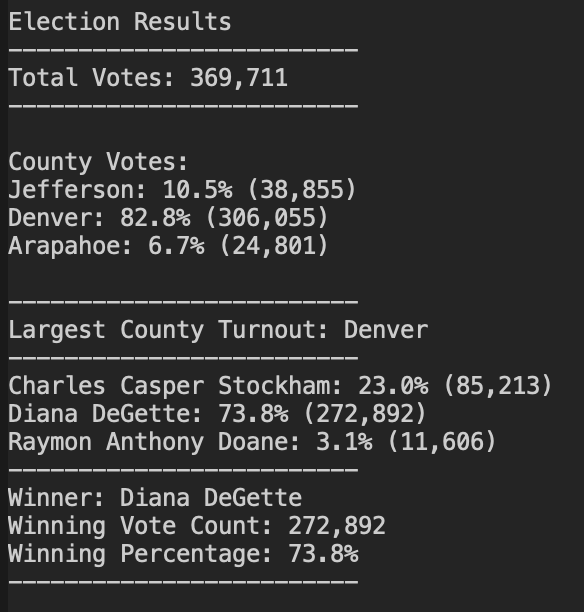

# Election Analysis

## Election Audit Overview
A Colorado Board of Elections employee has givine you the following tasks to complete the election audit of a recent local congressional election.

1. The voter turnout for each county
2. The percentage of votes from each county out of the total count
3. The county with the highest turnout
4. Calculate the total number of votes cast.
5. Get a complete list of candidates who received votes.
6. Calculate the total number of votes each candidate received.
7. Calculate the percentage of votes each candidate won.
8. Determine the winner of the election based on populate vote.

## Resources
- Date Source: election_results.csv
- Software: Python 3.7.2, Visual Studio Code 1.52.1

## Election Audit Results
The analysis of the election audit shows that:
- There were 369,711 votes cast in the election
- The counties were:
  - Jefferson
  - Denver
  - Arapahoe
- The county results were:
  - Jefferson county turnout was 10.5% of the total turnout with 38,855 votes cast
  - Denver county turnout was 82.8% of the total turnout with 306,055 votes cast
  - Arapahoe county turnout was 6.7% of the total turnout with 24,801 votes cast
- The county with the largest turnout was:
  - Denver county, which had 82.8% of the total turnout with 306,055 votes cast
- The candidates were:
  - Charles Casper Stockham
  - Diana DeGette
  - Raymon Anthony Doane
- The candidate results were:
  - Charles Casper Stockham received 23.0% of the vote with 85,213 votes
  - Diana DeGette received 73.8% of the vote with 272,892 votes
  - Raymon Anthony Doane received 3.1% of the vote with 11,606 votes
- The winner of the election was:
  - Diana DeGette, who received 73.8% of the vote with 272,892 votes



## Election Audit Summary
The script can be utiltized for any election as is if you put the data in Resources/election_results.csv.

There are some improvements that could be made to the script to be more useable.

Possible modifications:

1. Prompt the user for the name of the data file at the top of the script:
```
# get the filename from the user
filename = str(input("What is the name of the data file in the Resources directory you want to analyze?"))

# use the user input to generate the path to the file
file_to_load = os.path.join("Resources", filename)
```

2. Change the name of the output file to include the name of the input file so you can run the script multiple times without overwriting the past analysis:

```
# get the input filename without the .csv extension
output_filename = os.path.splitext(filename)[0]

# name the analysis file with the input filename as a prefix
file_to_save = os.path.join("analysis", output_filename + "_analysis.txt")
```

3. Alternatively, instead of prompting the user for the filename, you could put multiple files data files in the Resources folder, then have the script iterate over all the .csv files and analyze them. (Note: you would need to do something similar to #2 as well so you get all of the output data)